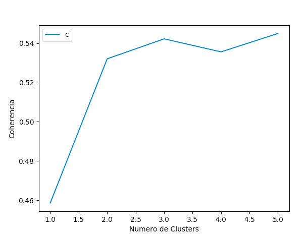

# 1. Desafío Legalbot
Se requiere crear un algoritmo que categorice el texto de constitución de empresas en un número de Clusters a determinar.

# 2. Descripción del Problema
Existe un archivo objetos.txt que contine 2863 líneas (cuerpo), en donde cada una representa el texto que describe la creación de una empresa. El idioma es español, y no existe una categoría asignada, simplemente el texto plano.  Se debe determinar el número de Clusters a construir, realizar la clusterizacion, evaluar los resultados, y presentar las métricas correspondientes.

# 3. Solución Propuesta
Se propone la utilizacion de un algoritmo de clustering llamado Latent Dirichlecht Allocation, en donde, dado un número de clusters inicial, se construye una distribución de probabilidad para cada una de las PALABRAS del cuerpo de texto(a que cluster representa dicha palabra), y luego, basada en esta distribución, se calcula a cual de estos Clusters pertenece cada DOCUMENTO (calculando el peso de cada palabra del documento para cada cluster).  Este enfoque permite que la asignación de un documento a un Cluster sea también una distribucion de probabilidad.  Por ejemplo, el documento 1 pertenece al cluster 5 con un 80% de probabilidad, al cluster 3 con un 10%, y al cluster 1 con 10%; esto se conoce como Soft Assignment.   Esto permite que el usuario final pueda tener una mejor visión de qué información se encuentra en cada documento, ya que en el clustering de documentos, es muy común que un artículo se trate de varios temas (clusters) simultáneamente,  medicina deportiva, o política enconomica, por ejemplo.

## 3.1 Alternativas
Otros enfoques de clusterizacion, como por ejemplo Gaussian Mixture Models, obligan a que cada documento debe pertenecer a un solo Cluster, con lo cual se pierde información al momento de la asignación.  Por otra parte, si se quiere asignar a un solo cluster usando LDA, se puede hacer simplemente tomando el cluster con mayor probabilidad.  

## 3.2 Evaluación
A diferencia de métodos Supervisados, en donde se aplican métricas como F1-Score, Precission y Recall, en métodos No-Supervisados existen 2 métricas comúnmente usadas para evaluar la clusterización: Coherencia y Perplexity.  
### 3.2.1 Perplexity 
Mide que tan bien puedo predecir la siguiente palabra para un conjunto de palabras dadas https://en.wikipedia.org/wiki/Perplexity dado un Modelo de Lenguaje previamente calculado

### 3.2.2 Coherence
Mide que tan similares son los textos que se encuentran en un Cluster en específico. http://svn.aksw.org/papers/2015/WSDM_Topic_Evaluation/public.pdf.

En este Desafío he elegido la métrica de Coherencia para determinar el número óptimo de Clusters a usar, ya que viene implementada directamente en el framework utilisado GenSim, y su interpretación es muy simple, a mayor coherencia mejor la clusterización.

# 4. Decisiones de implementación
## 4.1 Uso de n-grams de segundo nivel
He usado 2-grams (bigrams) para capturar la semántica de términos compuestos, y así el clustering puede enriquecer los resultados al considerar estos terminos como una palabra. Algunos de los bigrams que se generan son: `zona franca`, `propios ajenos`, `directa indidirectamente`, `nuevos usados`.

## 4.2 Eliminación de stopwords
Se eliminan los stopwords ya que no contribuyen a la semántica de los clusters que se quieren formar. Estos stopwords pueden aparecer con mucha frecuencia en muchos documentos a lo largo del corpus, y no hacen diferencia al momento de decidir a que cluster asignar un documento.   

## 4.3 No uso de TF-IDF como mecanismo de caracterización de documentos
Este mecanismo es muy usado feature extractor para determinar las principales palabras de cada documento, pero se requiere un cuerpo de datos mas grande (mas documentos y con mas contenido), que permita establecer con claridad las features importantes

## 4.4 Lemmatización
Se usa lemmatizacion en Sustantivos, Adjetivos, Verbos y Adverbios, ya que estas entidades son las que tienen terminaciones con mas variaciones en el idioma español.  Estas variaciones no aportan a resolver el problema en cuestión, ya aumentan la dimensionalidad del problema (cada palabra se considera una dimension en NLP) sin agregar mas semántica a los clusters.

## 4.5 No uso de embeddings para visualización 
Es posible construir WordEmbeddings para la visualizacion de Clusters, pero nuevamente está la limitante de los pocos datos.  Con 50.000 documentos ya es posible construir un Embedding de calidad.

## 4.6 Persistencia del Preprocesamiento
Todo el preprocesamiento de los datos conlleva un tiempo importante, y siempre generará el mismo resultado, por lo que he decidido almacenar estos resultados, para así solo tener que ejecutarlos una sola vez;  luego simplemente hay que concentrarse en experimentar con la clusterización.

## 4.7 Entrenamiento vs Tagging de Documentos
He separado el proceso de Entrenamiento y Tagging de Documentos en dos archivos fuente separados.

### 4.7.1 entrenamiento.py 
Realiza el preprocesamiento del texto, y luego construye los Clusters que se requieran

### 4.7.2 tagging.py
Asigna cada documento a un cluster en particular, y calcula datos adicionales para que sean interpretados por el usuario, tales como:  palabras que caracterizan a cada cluster (permite etiquetar dicho cluster), porcentaje de pertenencia de cada documento a cada Cluster, y estadísticas de cada Cluster con respecto al total de los documentos.

# 5. Resultados

## 5.1 Número óptimo de clusters
Los siguientes gráficos muestran que la mayor Coherencia se logra con un numero de clusters igual a 5.  Experimento ejecutado con 5, 10, y 30 Clusters respectivamente.

Para todos estos experimentos, 5 Clusters presenta la mayor coherencia.

## 5.2 Etiquetado de Clusters y Palabras Características
| Cluster Number  | Cluster Name | Palabras Características|
| :-------------: | :-------------: |------------- |
| 0  | COMERCIO MINORISTA  |venta, producto, menor, comerciar, articulos, mayor, almacenar, alimento, realizar, comprar|
| 1  | SERVICIOS PROFESIONALES  |servicio, actividad, prestacion, evento, profesional, produccion, relacionar, desarrollar, tipo, empresa|
| 2  | CONSTRUCCION / INDUSTRIAL  |construccion, obrar, servicio, equipo, industrial, menor, maquinaria, venta, general, ingenieria|
| 3  | TRANSPORTE Y MAQUINARIA  |actividad, servicio, transportar, empresarial, reparacion, fabricacion, equipar, tipo, maquinaria, alquiler|
| 4  | SOCIEDADES  | clase, bien, actividad, sociedad, relacionar, contar, tipo, objetar, general, tercero|

Dado que es un problema No-Supervisado, el etiquetado de los Clusters debe realizarse en forma manual, mediante la inspección visual de las palabras características de cada Cluster.  En este caso he elegido el nombre que me parecía mas adecuado a cada set de palabras (este etiquetado se puede mejorar con un experto en temas de escrituras de empresas).

&nbsp; 
**Nube de Puntos de todas las palabras mas representativas para la Clusterización**
&nbsp;&nbsp;  
&nbsp; 
**Cluster Comercio**
&nbsp;&nbsp;  

&nbsp; 
**Cluster Servicios Profesionales**
&nbsp;&nbsp;  
&nbsp; 
**Cluster Construcción/Industrial** 
&nbsp;&nbsp;  
&nbsp; 
**Cluster Transporte**
&nbsp;&nbsp;  

&nbsp; 
**Cluster Sociedades**
&nbsp;&nbsp;  

## 5.3 Ejemplos de documentos en cada cluster
| Cluster Number  | Documento |
| :-------------: | :------------- |
| 0  | COMERCIO AL POR MENOR DE OTROS PROD. NUEVOS EN ALMC. ESPECIALIZADOS, COMERCIO AL POR MENOR NO ESPECIALIZADO EN ALMACENES, COMERCIO AL POR MENOR NO REALIZADO EN ALMACENES.  |
| 1  | Enseñanza y capacitación a personas y empresas  |
| 2  | Venta de insumos mineros. Suministro de insumos, equipos, partes y piezas para la minería. Servicios y asesorías. Importaciones.  |
| 3  | ACTIVIDADES DE ARQUITECTURA E INGENIERÍA Y OTRAS ACTIVIDADES TÉCNICAS, CONSTRUCCIÓN, OTRAS ACTIVIDADES DE SERVICIOS.  |
| 4  | TURISMO RURAL Y URBANO, ASISTENCIA A TURISTAS, TRANSPORTES DE PASAJEROS, HOSPEDAJES, CABAÑAS, Y CAMPING.  |

# 6. Conclusión

# 7. Referencias

# 8. Como ejecutar el código

# 9. Requirements.txt
